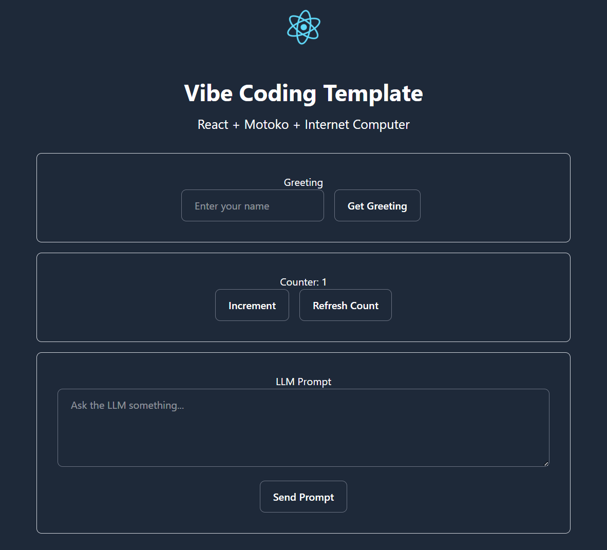

# 🧪🔥 Ultimate IC Vibe Coding Template

## 👋 Welcome to the Ultimate IC Vibe Coding Template!

This production-ready template powers your Internet Computer development with a complete stack featuring Motoko backend, React frontend, and integrated LLM capabilities. Built for professional developers seeking a fast path from concept to deployment, with testing and CI/CD built-in.

Start building high-performance dapps in minutes, not days.

## Welcome! 👋

This repository offers a high-quality, production-ready template to jumpstart your Internet Computer (ICP) development.

It includes:

- 💻 **Motoko-based Canister** backend
- 🔥 **React + Tailwind + Typescript** frontend
- 🧠 **IC LLM Canister** integration for Agentic workflows
- 🧪 **Full Test Suite**: Vitest + PocketIC for backend and frontend
- 🔁 **CI/CD** with GitHub Actions for automated tests and code quality
- 🤖 **Copilot Integration** to auto-generate tests, code, and changelogs

Whether you're building full-stack dapps or agents, this template gives you a solid foundation to start fast and scale smoothly. 🚀



---

## 📜 Table of Contents

- [🎥 Recording](#-recording)
- [🚀 Getting Started](#-getting-started)
- [📁 Project Structure](#-project-structure)
- [✅ Testing Patterns](#-testing-patterns)
- [🔄 CI/CD Workflow](#-cicd-workflow)
- [🧠 GitHub Copilot Integration](#-github-copilot-integration)
- [🔗 Resources & Documentation](#-learning-resources)
- [📩 Submit Your Project!](#-submit-your-project)

---

## 🎥 Recording

There was an Advanced Challenge Lab session, that was recorded and had a lot of information and showcase of Vibe Coding using a similar template in Rust.
Even in Rust the core logic and add-ons to this template are the same.

You can see here the full recording: https://www.youtube.com/watch?v=ZuNUy13wmlI

---

## 🚀 Getting Started

### 🧑‍💻 1. Get Codespace Ready

A **devcontainer** is preconfigured for you to start coding instantly!

- Click on "Use this Template" → "Create a new repository".
- Click "Code → Open with Codespaces"
- Change machine type to 4-core 16GB RAM • 32GB
- Once the codespace is created, you can open it in VS Code Local
- Everything is pre-installed and ready for you to run the following commands

### 2. Install Dependencies

```bash
npm install
mops install
```

### 3. Running Ollama

To be able to test the agent locally, you'll need a server for processing the agent's prompts. For that, we'll use `ollama`, which is a tool that can download and serve LLMs.
See the documentation on the [Ollama website](https://ollama.com/). Run:

```bash
ollama serve
# Expected to start listening on port 11434
```

The above command will start the Ollama server, so that it can process requests by the agent. Additionally, and in a separate window, run the following command to download the LLM that will be used by the agent:

```bash
ollama run llama3.1:8b
```

Once the command executes and the model is loaded, you can terminate it by typing /bye. You won't need to do this step again.

### 4. Deployment

Then, in one terminal window, run:

```bash
dfx start --clean
```

Keep this tab open for reading logs.

Then pull the dependency and deploy the canisters in another window:

```bash
dfx deploy # deploys the backend and frontend canisters
```

```bash
dfx deps pull
dfx deps deploy  # deploys the llm canister
```

### 5. Start the Development Server

You can start the frontend development server with:

```bash
# Just the frontend development server
npm start

```

### 6. Run Tests

```bash
npm test
```

You can also run:

```bash
npm test tests/src/backend.test.ts    # individual test
```

---

## 📁 Project Structure

```
ICP-Bootcamp-Vibe-Coding/
├── .devcontainer/devcontainer.json       # Container config for running your own codespace
├── .github/instructions/                 # Copilot general and language specific instructions
├── .github/prompts/                      # Copilot Prompts, like add feature and changes review
├── .github/workflows/                    # GitHub CI/CD pipelines
├── src/
│   ├── backend/                          # Motoko backend canister
│   │   └── main.mo                       # Main Motoko file
│   ├── frontend/                         # React + Tailwind + TypeScript frontend
│   │   ├── src/
│   │   │   ├── App.tsx                   # Main App component
│   │   │   ├── index.css                 # Global styles with Tailwind
│   │   │   ├── components/               # Reusable UI components
│   │   │   ├── services/                 # Canister service layers
│   │   │   └── views/                    # Page-level components
│   │   ├── assets/                       # Static assets (images, icons)
│   │   ├── tests/                        # Frontend unit tests
│   │   ├── index.html                    # Frontend entry point
│   │   ├── main.tsx                      # React main file
│   │   ├── package.json                  # Frontend dependencies
│   │   ├── tsconfig.json                 # TypeScript configuration
│   │   ├── vite.config.ts                # Vite build configuration
│   │   └── vite-env.d.ts                 # Vite type definitions
│   └── declarations/                     # Auto-generated canister interfaces
├── tests/
│   ├── src/                              # Backend test files
│   ├── backend-test-setup.ts             # PocketIC instance
│   └── vitest.config.ts                  # Vitest configuration
├── scripts/
│   ├── dev-container-setup.sh            # Extra set up steps for codespace
│   └── generate-candid.sh                # Useful one way script to build, generate candid and did files
├── dfx.json                              # ICP config
├── mops.toml                             # Root Motoko package config
└── CHANGELOG.md
```

---

## 🔄 CI/CD Workflow

Located under `.github/workflows/`, this includes:

- 🧪 Automated end-2-end test runs

It could be extended to:

- check for security updates (audit);
- test coverage;
- code quality.

---

## 🧠 **GitHub Copilot Integration**

This project leverages two key customization folders:

- `.github/instructions/` – Provides essential context to guide AI responses.
- `.github/prompts/` – Defines workflow prompts to effectively assist you.

Think of the AI as a super-fast junior developer, handling the heavy lifting while you focus on quality control. Instead of using PRs, you’re reviewing and refining code directly in the IDE through Copilot chat.

### 📝 **About Instructions**

Instructions provide "context" that applies to specific files using regex patterns defined in `applyTo`. They are ideal for project-wide or language-specific guidance.

**Current Instructions:**

- **general:** `applyTo: **`
- **motoko:** `applyTo: */*.mo`
- **test:** `applyTo: tests/**`

**Examples of Context You Can Define:**

- This is an ICP project using Motoko canisters.
- For Motoko, we follow standard style guides and linting tools.
- For tests, we use **Pocket IC** and maintain a specific test structure.

### 🛠️ **About Prompts**

Prompts define specific tasks and guide the AI through a structured workflow. They are especially useful for maintaining a consistent development process.

---

#### ✨ **Add Feature Prompt**

```markdown
/add-feature Add a function to decrease the counter value
```

In this workflow, Copilot follows a Spec Driven Workflow:

1. Clarification Phase:
   • Updates the changelog and asks for any necessary clarifications.
2. Test First Approach:
   • Generates a test case and ensures it fails, confirming that the test is effectively targeting the desired behavior.
3. Human Confirmation:
   • The AI pauses for a human to review and confirm the spec, ensuring alignment before proceeding.
4. Implementation Phase:
   • Implements the code, self-checks for errors, installs necessary libraries, lints, formats, and runs tests to confirm they pass.

**✅ Key Takeaways**

When you explore the prompt, please notice:

- CRITICAL PAUSE POINTS
  - Strategic pauses allow the human to verify the work in small, reviewable chunks and redirect if necessary.
- Command Explanations
  - The prompt can include specific commands or scripts, guiding the AI in self-checking, running scripts, or managing dependencies.
- Task-Specific Advice
  - The prompt is the place to add any specific guidance or notes relevant only to the particular task at hand.

#### 🚧 **Changes Review Prompt**

To run a review, simply call the prompt:

```markdown
/changes-review
```

The AI will analyze the current git diffs, then reference other files in the repo for context. It will generate a comprehensive report for you to review before committing.

#### ✅ **Focus Areas**

1. **Business Logic:**

   - Detects potential unwanted side effects or missing edge cases.

2. **Code Quality:**

   - Suggests improvements or refactor opportunities.

3. **Security & Performance:**
   - Identifies vulnerabilities or inefficiencies.

#### 📌 **Why It Matters**

- AI can handle the heavy lifting, but it's **your responsibility as the Senior** to validate the findings.
- Double-check and ensure quality – small issues now can become big problems later. 😉

---

## 📚 Learning Resources

- [Instruction and Prompt Files](https://code.visualstudio.com/docs/copilot/copilot-customization)
- [Agent Mode](https://code.visualstudio.com/docs/copilot/chat/chat-agent-mode)
- [Copilot Reference](https://code.visualstudio.com/docs/copilot/reference/copilot-vscode-features)
- [ICP Dev Docs](https://internetcomputer.org/docs)
- [Motoko Docs](https://internetcomputer.org/docs/motoko/home)
- [PicJS Doc](https://dfinity.github.io/pic-js/)
- [Vitest Testing Framework](https://vitest.dev/)

---

### 🤝 **Contributing**

We welcome contributions! If you encounter a bug, have a feature request, or want to suggest improvements, please open an issue or submit a Pull Request.

We especially welcome candidates of limits you face, consider using the **Limit Candidate Form Issue** – it helps us prioritize and address the most impactful limits effectively.

---

## 📩 Submit Your Project!

🎯 **Completed your challenge? Submit your project here:**  
📢 [Taikai Submission](https://taikai.network/icp-eu-alliance/hackathons/VIBATHON)

📌 **Want to explore more challenges? Return to the index:**  
🔗 [IC Vibathon Index](https://github.com/pt-icp-hub/IC-Vibathon-Index)

---

**Now go build something fast, tested, and production-ready 🚀**
