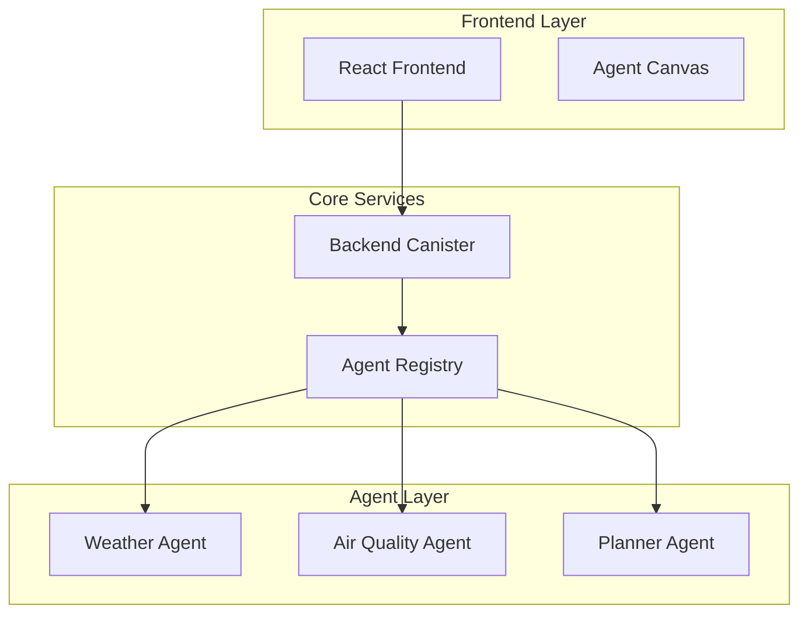

# MOMUS - Marketplace of Autonomous AI Agents

## Overview

MOMUS is a decentralized AI agent orchestration and marketplace platform built on the Internet Computer Protocol (ICP). It enables deploying, managing, and coordinating multiple AI agents with real-time capabilities and external API integrations.

## Key Features

- **🏗️ Multi-Agent System**: Modular agents for example Weather, Air Quality, and Planning Agents
- **🛒 Agent Marketplace**: Discover, deploy, and monetize AI agents
- **🧠 LLM Integration**: Powered by Llama 3.1 8B for intelligent responses
- **🌐 External APIs**: Real-time data from OpenWeatherMap and Air Quality APIs
- **🎨 Visual Workflows**: Interactive canvas for agent orchestration
- **⚡ Production-Ready**: Full test coverage and type safety

## Architecture Overview



## Quick Start Guide

### Prerequisites

- Node.js 18+
- DFX 0.15+ (Internet Computer SDK)
- Ollama (for local LLM)
- Git

### Local Development

1. **Clone and Install**

```bash
git clone https://github.com/zephyrzth/whcl-2025-momus.git
npm install
mops install
```

2. **Start Ollama (Required for LLM)**

```bash
./scripts/start-ollama.sh
```

3. **Deploy Local Environment**

```bash
# on different terminal, run
./scripts/start-server.sh
```

4. **Start Development Server**

```bash
# on different terminal, run
./scripts/deploy.sh
# wait for this log to show
# Frontend canister via browser:
#     frontend:
#       - http://by6od-j4aaa-aaaaa-qaadq-cai.localhost:4943/ (Recommended)
```

For more detailed documentation, please check:

- [Internet Computer Documentation](https://internetcomputer.org/docs)
- [Project Documentation](./docs/)
