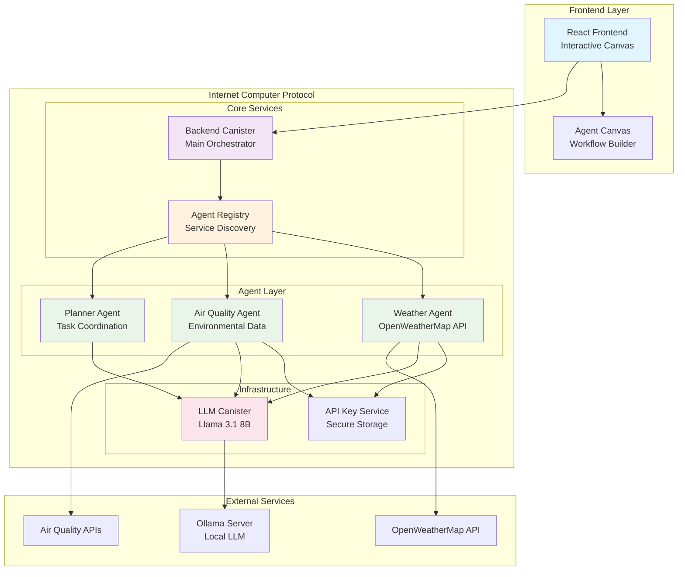
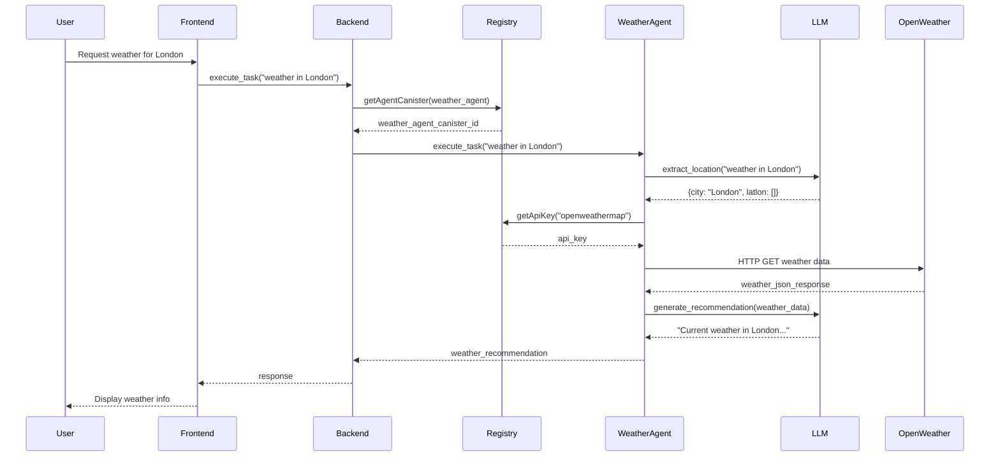
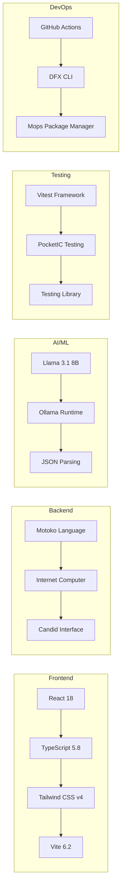
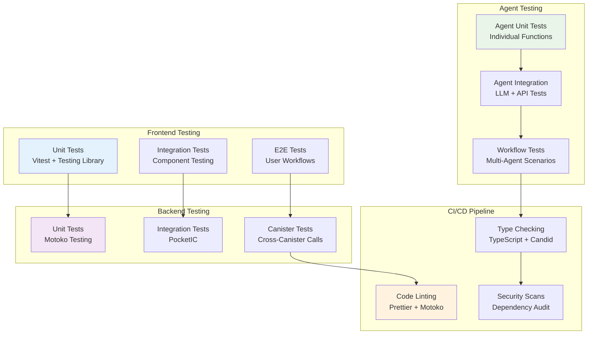

# � MOMUS - Multi-Agent Orchestration Platform

## Overview

**MOMUS** is a production-ready, decentralized AI agent orchestration and marketplace platform built on the Internet Computer Protocol (ICP). It provides a sophisticated framework for deploying, managing, and coordinating multiple AI agents with real-time capabilities, external API integrations, and advanced workflow orchestration.

### Key Features

- **🏗️ Multi-Agent Architecture**: Modular agent system with specialized capabilities (Weather, Air Quality, Planning)
- **🛒 AI Agent Marketplace**: Decentralized marketplace for discovering, deploying, and monetizing AI agents
- **🧠 LLM Integration**: Powered by Llama 3.1 8B for intelligent agent responses and task coordination
- **🌐 External API Integration**: HTTP outcalls for real-time data (OpenWeatherMap, Air Quality APIs)
- **📊 Centralized Registry**: Dynamic agent discovery and communication routing
- **🎨 Interactive Canvas**: Visual workflow builder for agent orchestration
- **⚡ Production-Ready**: Full test coverage, CI/CD, type safety, error handling
- **🔧 Developer Experience**: Hot reload, comprehensive tooling, GitHub Copilot integration

---

## 🏛️ System Architecture

### High-Level Architecture



### Agent Communication Flow



### Technical Stack



---

## 🚀 Quick Start Guide

### Prerequisites

- **Node.js** 18+ and npm
- **DFX** 0.15+ (Internet Computer SDK)
- **Ollama** (for local LLM development)
- **Git** for version control

### 1. Environment Setup

```bash
# Clone and setup
git clone <repository-url>
cd momus-platform
npm install
mops install

# Start Ollama server (required for LLM functionality)
ollama serve
ollama run llama3.1:8b  # Download model (one-time setup)
```

### 2. Complete Deployment

```bash
# One-command deployment
./scripts/deploy-all.sh

# This script will:
# ✅ Install dependencies
# ✅ Deploy all canisters
# ✅ Configure agent registry
# ✅ Setup API integrations
# ✅ Run integration tests
```

### 3. Development Server

```bash
# Start frontend development
npm start

# Access application
open http://localhost:5173
```

---

## 🔧 API Documentation

### Core Canister Interfaces

#### Backend Canister

```motoko
// Main orchestration functions
public func greet(name: Text) : async Text
public query func get_count() : async Nat64
public func execute_agent_workflow(nodes: [AgentNode], connections: [AgentConnection]) : async Text

// Canvas state management
public func save_canvas_state(state: CanvasState) : async ()
public query func get_canvas_state() : async ?CanvasState
```

#### Agent Registry

```motoko
// Agent discovery and management
public func setAgentCanister(agentType: AgentType, canisterId: Text) : async ()
public query func getAgentCanister(agentType: AgentType) : async ?Text
public func setApiKey(service: Text, key: Text) : async ()
public query func getApiKey(service: Text) : async ?Text
```

#### Weather Agent

```motoko
// Weather information services
public func execute_task(prompt: Text) : async Text
public func is_weather_api_configured() : async Bool
public query func get_metadata() : async AgentMetadata

// Internal data types
public type LocationResponse = {
    message: Text;    // "success" or "failed"
    reason: Text;     // error reason
    city: Text;       // extracted city name
    latlon: [Float];  // [latitude, longitude]
};

public type ParsedWeatherData = {
    description: Text;    // weather condition
    temp: Float;         // temperature (°C)
    feels_like: Float;   // apparent temperature
    visibility: Nat;     // visibility (meters)
    wind_speed: Float;   // wind speed (m/s)
    city_name: Text;     // location name
};
```

### HTTP Endpoints

#### Weather Agent Integration

```bash
# Get weather by city name
dfx canister call agent-weather_agent execute_task '("What is the weather in London?")'

# Check API configuration
dfx canister call agent-weather_agent is_weather_api_configured '()'

# Configure API key via registry
dfx canister call agent-registry setApiKey '("openweathermap", "your_api_key_here")'
```

#### Agent Registry Operations

```bash
# Register new agent
dfx canister call agent-registry setAgentCanister '(variant { weather_agent }, "canister_id_here")'

# Query available agents
dfx canister call agent-registry getAgentCanister '(variant { weather_agent })'

# Test agent communication
dfx canister call agent-planner_agent execute_task '("Get weather for Tokyo and air quality for Beijing")'
```

---

## 📁 Project Structure

```
momus-platform/
├── 🏗️ Infrastructure
│   ├── .devcontainer/           # Development container configuration
│   ├── .github/
│   │   ├── instructions/        # AI coding guidelines and context
│   │   ├── prompts/            # Workflow automation prompts
│   │   └── workflows/          # CI/CD automation
│   ├── scripts/                # Deployment and setup automation
│   ├── dfx.json               # ICP canister configuration
│   └── mops.toml              # Motoko package management
│
├── 🧠 Agent System
│   ├── src/agents/
│   │   ├── agent_registry/     # Central agent discovery service
│   │   │   └── main.mo        # Registry implementation
│   │   ├── weather_agent/     # Weather information service
│   │   │   └── main.mo        # Weather + LLM integration
│   │   ├── airquality_agent/  # Air quality monitoring
│   │   │   └── main.mo        # Environmental data service
│   │   └── planner_agent/     # Task coordination service
│   │       └── main.mo        # Multi-agent orchestration
│   │
│   ├── src/shared/            # Common interfaces and types
│   │   ├── AgentInterface.mo  # Standard agent contract
│   │   └── AgentRegistryInterface.mo
│   │
│   └── src/services/          # Shared business logic
│       ├── AgentDiscoveryService.mo
│       └── ApiKeyService.mo   # Secure credential management
│
├── 🎨 Frontend Application
│   ├── src/frontend/
│   │   ├── src/
│   │   │   ├── components/    # Reusable UI components
│   │   │   │   ├── nodes/     # Canvas node components
│   │   │   │   ├── ui/        # Base UI elements
│   │   │   │   ├── AgentCard.tsx
│   │   │   │   ├── Button.tsx
│   │   │   │   └── NavigationBar.tsx
│   │   │   ├── services/      # Canister integration layer
│   │   │   │   ├── agentExecutionService.ts
│   │   │   │   └── canvasService.ts
│   │   │   ├── types/         # TypeScript definitions
│   │   │   ├── views/         # Page-level components
│   │   │   └── App.tsx        # Main application
│   │   ├── tests/             # Frontend unit tests
│   │   ├── index.html         # Application entry point
│   │   ├── vite.config.ts     # Build configuration
│   │   └── package.json       # Frontend dependencies
│   │
│   └── src/declarations/      # Auto-generated canister bindings
│       ├── backend/           # Backend canister types
│       ├── agent-registry/    # Registry canister types
│       └── agent-*/           # Individual agent types
│
├── 🧪 Testing Infrastructure
│   ├── tests/
│   │   ├── src/
│   │   │   ├── backend.test.ts        # Backend integration tests
│   │   │   └── weather_agent.test.ts  # Agent-specific tests
│   │   └── vitest.config.ts           # Test configuration
│   │
│   └── src/frontend/tests/            # Frontend unit tests
│       ├── App.test.tsx
│       ├── services/
│       └── views/
│
└── 📚 Documentation
    ├── docs/                          # Technical documentation
    │   ├── api-key-management.md
    │   ├── canvas-backend-integration.md
    │   └── weather-agent-frontend.md
    ├── CHANGELOG.md                   # Version history
    ├── QUICKSTART.md                  # 5-minute setup guide
    └── README.md                      # This file
```

### Key Technical Components

#### 🏗️ **Agent Registry Pattern**

- **Centralized Discovery**: Single source of truth for agent locations
- **Dynamic Routing**: Runtime agent resolution and communication
- **Service Abstraction**: Clean separation between agent logic and discovery

#### 🧠 **LLM Integration Architecture**

- **Structured Prompting**: JSON-based communication with language models
- **Error Recovery**: Robust parsing and fallback mechanisms
- **Context Management**: Efficient prompt engineering for agent tasks

#### 🌐 **HTTP Outcall System**

- **External API Integration**: Secure communication with external services
- **Cycle Management**: Automatic resource allocation for HTTP requests
- **Response Parsing**: Type-safe JSON processing and error handling

#### 🎨 **Interactive Canvas System**

- **Visual Workflow Builder**: Drag-and-drop agent orchestration
- **Real-time State Sync**: Persistent canvas state management
- **Component Architecture**: Modular, reusable UI components

---

## ✅ Testing & Quality Assurance

### Test Architecture



### Running Tests

```bash
# Complete test suite
npm test

# Frontend tests only
npm run test:frontend

# Backend tests only
npm run test:backend

# Individual test files
npm test tests/src/weather_agent.test.ts
npm test src/frontend/tests/App.test.tsx

# Watch mode for development
npm test -- --watch
```

### Test Examples

#### Backend Integration Test

```typescript
// tests/src/backend.test.ts
describe("Backend Canister", () => {
  let pic: PocketIc;
  let backend: ActorSubclass<_SERVICE>;

  beforeEach(async () => {
    pic = await PocketIc.create();
    const fixture = await pic.setupCanister<_SERVICE>({
      idlFactory: backendIdlFactory,
      wasm: resolve(
        __dirname,
        "../..",
        "target/wasm32-unknown-unknown/release/backend.wasm",
      ),
    });
    backend = fixture.actor;
  });

  test("should execute agent workflow", async () => {
    const nodes = [{ id: "weather-1", nodeType: "weather_agent" /* ... */ }];
    const connections = [
      { id: "conn-1", source: "input", target: "weather-1" /* ... */ },
    ];

    const result = await backend.execute_agent_workflow(nodes, connections);
    expect(result).toContain("weather");
  });
});
```

#### Agent Unit Test

```typescript
// tests/src/weather_agent.test.ts
describe("Weather Agent", () => {
  test("should extract location from prompt", async () => {
    const agent = await setupWeatherAgent();
    const result = await agent.execute_task("What is the weather in Tokyo?");

    expect(result).toMatch(/tokyo/i);
    expect(result).toMatch(/temperature|weather/i);
  });

  test("should handle API configuration errors", async () => {
    const agent = await setupWeatherAgent({ skipApiKey: true });
    const result = await agent.execute_task("Weather in London");

    expect(result).toContain("API key not configured");
  });
});
```

---

## 🚀 Production Deployment

### ICP Mainnet Deployment

```bash
# 1. Configure mainnet identity
dfx identity new mainnet
dfx identity use mainnet

# 2. Add cycles to wallet
dfx wallet --network ic balance
dfx wallet --network ic send <CANISTER_ID> <CYCLES>

# 3. Deploy to mainnet
dfx deploy --network ic

# 4. Configure production settings
dfx canister --network ic call agent-registry setApiKey '("openweathermap", "prod_api_key")'
```

### Environment Configuration

```bash
# .env.production
NETWORK=ic
WEATHER_API_KEY=your_production_key
LLM_CANISTER_ID=w36hm-eqaaa-aaaal-qr76a-cai
REGISTRY_CANISTER_ID=be2us-64aaa-aaaaa-qaabq-cai
```

### Performance Optimization

#### Canister Optimization

- **Memory Management**: Efficient state persistence with stable variables
- **Cycle Management**: Automatic cycle monitoring and alerts
- **Query/Update Balance**: Optimized function classifications for performance

#### Frontend Optimization

- **Code Splitting**: Lazy loading for agent components
- **Bundle Analysis**: Webpack bundle analyzer integration
- **CDN Integration**: Static asset optimization

---

## 🔄 CI/CD & DevOps

### GitHub Actions Workflow

```yaml
# .github/workflows/test-and-deploy.yml
name: Test and Deploy
on: [push, pull_request]

jobs:
  test:
    runs-on: ubuntu-latest
    steps:
      - uses: actions/checkout@v4
      - name: Setup Node.js
        uses: actions/setup-node@v4
        with:
          node-version: "18"

      - name: Install dependencies
        run: |
          npm install
          mops install

      - name: Run tests
        run: npm test

      - name: Build frontend
        run: npm run build

  deploy:
    needs: test
    if: github.ref == 'refs/heads/main'
    runs-on: ubuntu-latest
    steps:
      - name: Deploy to IC
        env:
          DFX_IDENTITY: ${{ secrets.DFX_IDENTITY }}
        run: |
          dfx deploy --network ic
```

### Code Quality Gates

```bash
# Pre-commit hooks (via Husky)
npm run lint          # Prettier + ESLint
npm run type-check    # TypeScript validation
npm run test:quick    # Fast test suite
mops test            # Motoko unit tests
```

---

## 🧠 AI-Powered Development

### GitHub Copilot Integration

The platform includes sophisticated AI-powered development workflows:

#### 📝 **Instruction System**

- **Context-Aware**: File-pattern based instructions for different components
- **Language-Specific**: Tailored guidance for Motoko, TypeScript, and testing
- **Project-Aware**: ICP-specific best practices and patterns

#### 🛠️ **Automated Workflows**

**Feature Development Prompt:**

```bash
/add-feature Add real-time air quality monitoring with health recommendations
```

**Code Review Prompt:**

```bash
/changes-review
```

#### ✨ **AI Capabilities**

- **Spec-Driven Development**: Automated test generation and TDD workflows
- **Code Quality Analysis**: Automated security, performance, and maintainability reviews
- **Documentation Generation**: Context-aware documentation and API reference updates
- **Refactoring Assistance**: Safe code transformations with test validation

---

## 📚 Technical Resources

### ICP & Motoko Development

- [Internet Computer Documentation](https://internetcomputer.org/docs)
- [Motoko Language Guide](https://internetcomputer.org/docs/motoko/main/motoko)
- [Candid Reference](https://internetcomputer.org/docs/current/references/candid-ref)
- [Agent Architecture Patterns](https://internetcomputer.org/docs/current/developer-docs/agents/)

### Frontend Development

- [React 18 Documentation](https://react.dev/)
- [Vite Build Tool](https://vitejs.dev/)
- [Tailwind CSS v4](https://tailwindcss.com/)
- [TypeScript Handbook](https://www.typescriptlang.org/docs/)

### Testing & Quality

- [Vitest Testing Framework](https://vitest.dev/)
- [PocketIC Testing Library](https://dfinity.github.io/pic-js/)
- [Testing Library](https://testing-library.com/)
- [ICP Testing Best Practices](https://internetcomputer.org/docs/current/developer-docs/backend/candid/candid-concepts)

### AI & LLM Integration

- [Ollama Documentation](https://ollama.com/)
- [Llama 3.1 Model Guide](https://ai.meta.com/blog/meta-llama-3-1/)
- [JSON Parsing in Motoko](https://mops.one/json)
- [HTTP Outcalls on ICP](https://internetcomputer.org/docs/current/developer-docs/integrations/http_requests/)

---

## 🤝 Contributing

### Development Workflow

1. **Fork & Clone**: Create your fork and clone locally
2. **Feature Branch**: Create feature branch (`git checkout -b feature/agent-enhancement`)
3. **Development**: Follow TDD practices with comprehensive testing
4. **Quality Checks**: Run linting, type checking, and full test suite
5. **Pull Request**: Submit PR with detailed description and test coverage

### Code Standards

- **Motoko**: Follow [Motoko Style Guide](https://dfinity.github.io/motoko-style-guide/)
- **TypeScript**: ESLint + Prettier configuration included
- **Testing**: Minimum 80% code coverage for new features
- **Documentation**: Update README and inline documentation for public APIs

### Issue Templates

- 🐛 **Bug Report**: Detailed reproduction steps and environment info
- ✨ **Feature Request**: Use case description and acceptance criteria
- 🔧 **Technical Debt**: Performance improvements and refactoring
- 📚 **Documentation**: Documentation improvements and additions

---

## 📩 Deployment & Submission

### Platform Information

- **Repository**: [GitHub Repository](https://github.com/your-repo/momus-platform)
- **Live Demo**: [ICP Canister URL](https://your-canister-id.icp0.io)
- **Documentation**: [Technical Docs](./docs/)

### Submission Checklist

- ✅ All tests passing
- ✅ Code quality gates met
- ✅ Documentation updated
- ✅ Deployment successful
- ✅ Security review completed

---

**🚀 Ready to build the future of decentralized AI agents? Start coding!**

````

---

## 🔄 CI/CD Workflow

Located under `.github/workflows/`, this includes:

- 🧪 Automated end-2-end test runs

It could be extended to:

- check for security updates (audit);
- test coverage;
- code quality.

---

## 🧠 **GitHub Copilot Integration**

This project leverages two key customization folders:

- `.github/instructions/` – Provides essential context to guide AI responses.
- `.github/prompts/` – Defines workflow prompts to effectively assist you.

Think of the AI as a super-fast junior developer, handling the heavy lifting while you focus on quality control. Instead of using PRs, you’re reviewing and refining code directly in the IDE through Copilot chat.

### 📝 **About Instructions**

Instructions provide "context" that applies to specific files using regex patterns defined in `applyTo`. They are ideal for project-wide or language-specific guidance.

**Current Instructions:**

- **general:** `applyTo: **`
- **motoko:** `applyTo: */*.mo`
- **test:** `applyTo: tests/**`

**Examples of Context You Can Define:**

- This is an ICP project using Motoko canisters.
- For Motoko, we follow standard style guides and linting tools.
- For tests, we use **Pocket IC** and maintain a specific test structure.

### 🛠️ **About Prompts**

Prompts define specific tasks and guide the AI through a structured workflow. They are especially useful for maintaining a consistent development process.

---

#### ✨ **Add Feature Prompt**

```markdown
/add-feature Add a function to decrease the counter value
````

In this workflow, Copilot follows a Spec Driven Workflow:

1. Clarification Phase:
   • Updates the changelog and asks for any necessary clarifications.
2. Test First Approach:
   • Generates a test case and ensures it fails, confirming that the test is effectively targeting the desired behavior.
3. Human Confirmation:
   • The AI pauses for a human to review and confirm the spec, ensuring alignment before proceeding.
4. Implementation Phase:
   • Implements the code, self-checks for errors, installs necessary libraries, lints, formats, and runs tests to confirm they pass.

**✅ Key Takeaways**

When you explore the prompt, please notice:

- CRITICAL PAUSE POINTS
  - Strategic pauses allow the human to verify the work in small, reviewable chunks and redirect if necessary.
- Command Explanations
  - The prompt can include specific commands or scripts, guiding the AI in self-checking, running scripts, or managing dependencies.
- Task-Specific Advice
  - The prompt is the place to add any specific guidance or notes relevant only to the particular task at hand.

#### 🚧 **Changes Review Prompt**

To run a review, simply call the prompt:

```markdown
/changes-review
```

The AI will analyze the current git diffs, then reference other files in the repo for context. It will generate a comprehensive report for you to review before committing.

#### ✅ **Focus Areas**

1. **Business Logic:**
   - Detects potential unwanted side effects or missing edge cases.

2. **Code Quality:**
   - Suggests improvements or refactor opportunities.

3. **Security & Performance:**
   - Identifies vulnerabilities or inefficiencies.

#### 📌 **Why It Matters**

- AI can handle the heavy lifting, but it's **your responsibility as the Senior** to validate the findings.
- Double-check and ensure quality – small issues now can become big problems later. 😉

---

## 📚 Learning Resources

- [Instruction and Prompt Files](https://code.visualstudio.com/docs/copilot/copilot-customization)
- [Agent Mode](https://code.visualstudio.com/docs/copilot/chat/chat-agent-mode)
- [Copilot Reference](https://code.visualstudio.com/docs/copilot/reference/copilot-vscode-features)
- [ICP Dev Docs](https://internetcomputer.org/docs)
- [Motoko Docs](https://internetcomputer.org/docs/motoko/home)
- [PicJS Doc](https://dfinity.github.io/pic-js/)
- [Vitest Testing Framework](https://vitest.dev/)

---

### 🤝 **Contributing**

We welcome contributions! If you encounter a bug, have a feature request, or want to suggest improvements, please open an issue or submit a Pull Request.

We especially welcome candidates of limits you face, consider using the **Limit Candidate Form Issue** – it helps us prioritize and address the most impactful limits effectively.

---

## 📩 Submit Your Project!

🎯 **Completed your challenge? Submit your project here:**  
📢 [Taikai Submission](https://taikai.network/icp-eu-alliance/hackathons/VIBATHON)

📌 **Want to explore more challenges? Return to the index:**  
🔗 [IC Vibathon Index](https://github.com/pt-icp-hub/IC-Vibathon-Index)

---

**Now go build something fast, tested, and production-ready 🚀**
